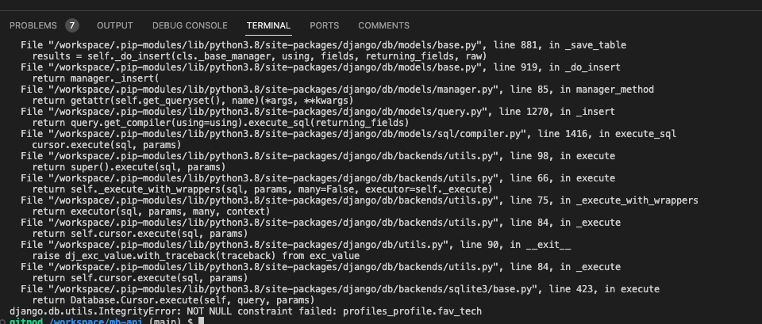

# Contents

[Matte Black](#matte-black)
[Project Goals](#project-goals)
[Planning](#planning)

[Testing](#testing)
+ [Code Validator Testing](#code-validator-testing)
+ [Manual Testing](#manual-testing)

[Bugs](#bugs)
+ [Fixed Bugs](#fixed-bugs)
+ [Unfixed Bugs](#unfixed-bugs)

[Deployment](#deployment)

[References](#references)

[Acknowledgements](#acknowledgements)

# Matte Black

Live Site: [Click Here](https://matte-black.herokuapp.com/)
Github Frontend: [Click Here](https://github.com/PritenMakwana44/matte-black)
Github Backend: [Click Here](https://github.com/PritenMakwana44/mb-api)

# Project Goals
The purpose of this website was to give tech lovers a place to share posts about their tech and aesthetic looking pictures of their tech setups.
Along with this the agenda was to build a community where like minded tech enthusiats can come togther to discuss and share their favourite tech.

The application was built on HTML, CSS, Javascript, React.js, Bootstrap and Django REST Framework.

# Planning

Here is my database schema:

# Testing

## Code Validator Testing
I used [CI Python Linter](https://pep8ci.herokuapp.com/) to validate all my code. There was a built in validator too but I ran it through the linter just incase.
Only 1 issue was picked up which is in my settings.py:
"line too long (83 > 79 characters)"
I was unable to find any way of shortening the line any more.

## Manual Testing

I used the following Table to test my backend apps.

---

Here are the series of tests manually conducted:

## Posts Testing

Add Post testing

Read Post testing

Edit Post testing

Edit Post after testing

Delete Post testing

Delete Post after testing

---

## Profile Testing

Create User testing

Profile edit testing

Profile read testing

Profile read detail testing

---

## Gallerypost Testing

Gallery post add testing

Gallery post read testing

Gallery post edit testing

Gallery post delete testing

---

## Follower Testing

Follower read testing

Follower create testing

Follower delete testing

---

## Contact Testing

Contact create testing

Contact read testing

---

## Comment Testing

Comment create testing

Comment read testing

Comment edit testing

Comment delete testing

---

## Gallery Comment Testing

Gallery comment create testing

Gallery comment read testing

Gallery comment edit testing

Gallery comment delete testing

---

## Save Testing

Save create testing

Save read testing

Save delete testing

---

# Bugs
## Fixed Bugs

1. Error when creating new user. Fix: delete local database

    

## Unfixed Bugs

Due to time constrains we were unable to fix these following bugs:

1. Issue: When adding or editing  reviews the draft function looses the post as a end user.
Potential fix: Add a draft section in navbar where all drafts are saved.

# Deployment

## Deployment of Project:
Github:
1. Go to Code Insitite Template [CI template](https://github.com/Code-Institute-Org/gitpod-full-template)
2. Click use this template
3. Click Create new Repository
4. Name accordingly

Heroku/Elephant SQL
1. Login or Sign up to Heroku
2. Create new app
3. Name accordingly
4. Create Database in ElephantSQL:
    1. Sign up or Login
    2. Create new instance
    3. Give your plan a Name (this is commonly the name of the project), Select the Tiny Turtle (Free) plan, You can leave the Tags field blank
    4. Select region nearest to you
    5. Review and click create instance
    6. Open your new instance and grab your URL for use.
5. Create env.py in Django project with Database URL and setup a secret key. The code looks like this:
    import os
    os.environ["DATABASE_URL"]="<copiedURL>"
    os.environ["SECRET_KEY"]="my_super^secret@key"
6. Make sure it's added to your gitignore
7. Modify settings.py by adding:
    import os
    import dj_database_url
    if os.path.isfile('env.py'):
        import env
8. Lower down in settings.py add:
    SECRET_KEY = os.environ.get('SECRET_KEY')
9. Hook up your database by commenting account old database code and adding new:
    Comment out this:
     DATABASES = {
         'default': {
            'ENGINE': 'django.db.backends.sqlite3',
            'NAME': BASE_DIR / 'db.sqlite3',
        }
    }
    
    Add this:
    DATABASES = {
        'default': dj_database_url.parse(os.environ.get("DATABASE_URL"))
    }

10. Run python manage.py migrate
11. Push project to Github
12. In your Heroku go to your app
13. Go to settings
14. Config vars
15. Add your DATABASE_URL and SECRET_KEY and PORT as 8000.
16. Create Storage via Cloudinary:
    1. Create Cloudinary account
    2. Copy API Environment variable
    3. Add follwing to env.py:
        os.environ["CLOUDINARY_URL] = Add environment variable here
    4. Add same details into Heroku Config Vars to match.
    5. Add DISABLE_COLLECTSTATIC to 0 in Heroku Config Vars too.(removed at the end)
    6. Add following Cloudinary apps to  installed apps in settings.py:
            INSTALLED_APPS = [
                'django.contrib.admin',
                'django.contrib.auth',
                'django.contrib.contenttypes',
                'django.contrib.sessions',
                'django.contrib.messages',
                'django.contrib.sites',
                'cloudinary_storage',
                'django.contrib.staticfiles',
                'cloudinary',
            ]
    7. Towards the end of settings.py add:

        STATICFILES_STORAGE = 'cloudinary_storage.storage.'\
                      'StaticHashedCloudinaryStorage'
        STATICFILES_DIRS = [os.path.join(BASE_DIR, 'static')]
        STATIC_ROOT = os.path.join(BASE_DIR, 'staticfiles')

        MEDIA_URL = '/media/'
        DEFAULT_FILE_STORAGE = 'cloudinary_storage.storage.MediaCloudinaryStorage'

17. Add template files accordingly in settings.py:
            TEMPLATES_DIR = os.path.join(BASE_DIR, 'templates')
18. Under Templates in the settings.py file change 'DIRS' to reflect templates:
        'DIRS': [TEMPLATES_DIR],
19. Add Heroku Allowed hosts in settings.py:
        ALLOWED_HOSTS = ['unfiltered-anime.herokuapp.com', 'localhost']
20. create media, static and templates folders in root of project. 
21. Create Procfie with:
        web: gunicorn unfiltered_anime.wsgi
22. Deploy to Github.
23. Back into Heroku go back into your app and click deploy then for deployment method link to your Github.
24. Search for repo name and connect
25. Deploy branch and enable automatic deployment.

Once your finish your project make sure you do the following:
Remove DISABLE_COLLECTSTATIC from Heroku VARS.
In your settings.py turn off debugging. 

# References
1. Template Used as respository: [CI template](https://github.com/Code-Institute-Org/gitpod-full-template)
2. Fonts used were from Google Fonts: [Google Fonts](https://fonts.google.com/)
3. Icons were taken from Font Awesone: [Font Awesome](https://fontawesome.com/)
4. Inspiration for structures, models, views and URLS were taken from the "I think therefore I Blog" project walkthrough: [I think there I blog Walkthrogh](https://github.com/Code-Institute-Solutions/Django3blog/tree/master/11_messages)
5. Much of Project help was taken from Django Central such as issues linking URL, Models and views: [Django Central Articles](https://djangocentral.com/articles/)
6. For General help through out my project teh offical Django documentation was great help: [Django](https://docs.djangoproject.com/)
7. Bootstrap was used for design and structure of UI: [Bootstrap](https://getbootstrap.com/)
8. Button design was fro I used "Buy me a coffee": [Copy & Paste CSS] (https://copy-paste-css.com/)
9. Placeholder images are taken from: [Pixabay](https://pixabay.com/)
10. Deployment was on Heroku: [Heroku](https://heroku.com/)
11. Static media storage: [Cloudinary](https://cloudinary.com/)
12. Database: [ElephantSQL](https://elephantsql.com)
13. HTML template used for Blog: [Clean Blog](https://startbootstrap.com/theme/clean-blog)
14. Extended text fields for Bootstrap: [Summernote](https://summernote.org/)
15. Django Authentication source: [Django-allauth](https://django-allauth.readthedocs.io/en/latest/)
16. Django general help: [Mozilla Developers](https://developer.mozilla.org/)
17. Wireframe: [Balsamiq](https://balsamiq.com/)
18. Models diagram: [LucidChart](https://www.lucidchart.com/)
19. Favicon Generator: [Favicon Generator](https://favicon.io/favicon-converter/)
20. General help taken for HTML, CSS, JS, Python and django: [W3schools](https://www.w3schools.com/)
21. General project help was also taken from Reddit: [Reddit](https://www.reddit.com/)
22. General project help was also taken from Stackoverflow: [StackOverflow](https://stackoverflow.com/)
23. Help with watch list article: [Article for Watchlist 1](https://stackoverflow.com/questions/63403309/watchlist-system-on-django) , [Article for Watchlist 2](https://forum.djangoproject.com/t/adding-watchlist-watchlist-not-displaying-added-items/12411)
24. Top of page button: [Top of page button](https://www.w3schools.com/howto/howto_js_scroll_to_top.asp)

# Acknowledgements
1. Much help was taken from Tutors at Code Institute.
2. Much help and inspirtation was taken from Code Insitute course materials.
3. Much help was taken from Code Institute Slack channels. 