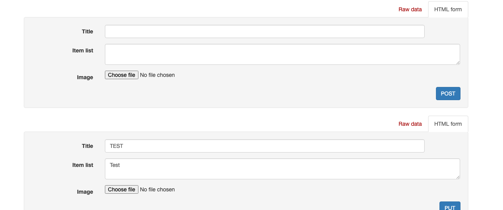

# Contents

[Matte Black](#matte-black)

[Project Goals](#project-goals)

[Planning](#planning)

[Testing](#testing)
+ [Code Validator Testing](#code-validator-testing)
+ [Manual Testing](#manual-testing)

[Bugs](#bugs)
+ [Fixed Bugs](#fixed-bugs)
+ [Unfixed Bugs](#unfixed-bugs)

[Technologies Used](#technologies-used)

[Deployment](#deployment)

[References](#references)

[Acknowledgements](#acknowledgements)

# Matte Black

Live Site: [Click Here](https://matte-black.herokuapp.com/)
Github Frontend: [Click Here](https://github.com/PritenMakwana44/matte-black)
Github Backend: [Click Here](https://github.com/PritenMakwana44/mb-api)

# Project Goals
The purpose of this website was to give tech lovers a place to share posts about their tech and aesthetic looking pictures of their tech setups.
Along with this the agenda was to build a community where like minded tech enthusiats can come togther to discuss and share their favourite tech.

The application was built on HTML, CSS, Javascript, React.js, Bootstrap and Django REST Framework.

# Planning

Here is my database schema:

# Testing

## Code Validator Testing
I used [CI Python Linter](https://pep8ci.herokuapp.com/) to validate all my code. There was a built in validator too but I ran it through the linter just incase.
Only 1 issue was picked up which is in my settings.py:
"line too long (83 > 79 characters)"
I was unable to find any way of shortening the line any more.

## Manual Testing

I used the following Table to test my backend apps.

---

Here are the series of tests manually conducted:

## Posts Testing

Add Post testing

Read Post testing

Edit Post testing

Edit Post after testing

Delete Post testing

Delete Post after testing

---

## Profile Testing

Create User testing

Profile edit testing

Profile read testing

Profile read detail testing

---

## Gallerypost Testing

Gallery post add testing

Gallery post read testing

Gallery post edit testing

Gallery post delete testing

---

## Follower Testing

Follower read testing

Follower create testing

Follower delete testing

---

## Contact Testing

Contact create testing

Contact read testing

---

## Comment Testing

Comment create testing

Comment read testing

Comment edit testing

Comment delete testing

---

## Gallery Comment Testing

Gallery comment create testing

Gallery comment read testing

Gallery comment edit testing

Gallery comment delete testing

---

## Save Testing

Save create testing

Save read testing

Save delete testing

---

# Bugs
## Fixed Bugs

More bugs can be found in my front end readme

1. Error when creating new user. Fix: delete local database

    

---

## Unfixed Bugs

More bugs can be found in my front end readme

Due to time constrains we were unable to fix these following bugs:

1. When going into gallery posts with an id number I get a double form as shown below.

---

# Technologies Used

- Django Rest framework
- Python
- Cloudinary
- ElephanSQL postgress
- CORS Headers
- Pillow
- Allauth
- Gunicorn

## Modules:

- asgiref==3.6.0
- cloudinary==1.32.0
- dj-database-url==0.5.0
- dj-rest-auth==2.1.9
- Django==3.2.18
- django-allauth==0.44.0
- django-cloudinary-storage==0.3.0
- django-cors-headers==3.14.0
- django-filter==22.1
- djangorestframework==3.14.0
- djangorestframework-simplejwt==5.2.2
- gunicorn==20.1.0
- oauthlib==3.2.2
- Pillow==9.4.0
- psycopg2==2.9.5
- PyJWT==2.6.0
- python3-openid==3.2.0
- pytz==2022.7.1
- requests-oauthlib==1.3.1
- sqlparse==0.4.3

# Deployment

## Deployment of Project:
Github:
1. Go to Code Insitite Template [CI template](https://github.com/Code-Institute-Org/gitpod-full-template)
2. Create project using template
Project setup:
3. Install Django using the pip3 install 'django<4' command in terminal
4. Create project using django-admin startproject 'projectname'
5. Install cloudinary and Pillow via pip install django-cloudinary-storage==0.3.0 and pip install Pillow==8.2.0
6. Add the following to your installed apps in your settings.py " 'cloudinary_storage','django.contrib.staticfiles' and'cloudinary. Make sure they are added in that order top to bottom:

[installedapps1](/readme/images/deployment/installedapps1.png)

7. Create a env.py in root of directory with import.os and os.environ["CLOUDINARY_URL"] = "cloudinary://API KEY HERE"

[cloudinary env.py](/readme/images/deployment/cloudinaryenv.py.png)

8. Add following to your settings.py:

[settings.py1](/readme/images/deployment/settings.py1.png)

# References
1. Template Used as respository: [CI template](https://github.com/Code-Institute-Org/gitpod-full-template)
2. Fonts used were from Google Fonts: [Google Fonts](https://fonts.google.com/)
3. Icons were taken from Font Awesone: [Font Awesome](https://fontawesome.com/)
4. Inspiration for structures, models, views and URLS were taken from the "I think therefore I Blog" project walkthrough: [I think there I blog Walkthrogh](https://github.com/Code-Institute-Solutions/Django3blog/tree/master/11_messages)
5. Much of Project help was taken from Django Central such as issues linking URL, Models and views: [Django Central Articles](https://djangocentral.com/articles/)
6. For General help through out my project teh offical Django documentation was great help: [Django](https://docs.djangoproject.com/)
7. Bootstrap was used for design and structure of UI: [Bootstrap](https://getbootstrap.com/)
8. Button design was fro I used "Buy me a coffee": [Copy & Paste CSS] (https://copy-paste-css.com/)
9. Placeholder images are taken from: [Pixabay](https://pixabay.com/)
10. Deployment was on Heroku: [Heroku](https://heroku.com/)
11. Static media storage: [Cloudinary](https://cloudinary.com/)
12. Database: [ElephantSQL](https://elephantsql.com)
13. HTML template used for Blog: [Clean Blog](https://startbootstrap.com/theme/clean-blog)
14. Extended text fields for Bootstrap: [Summernote](https://summernote.org/)
15. Django Authentication source: [Django-allauth](https://django-allauth.readthedocs.io/en/latest/)
16. Django general help: [Mozilla Developers](https://developer.mozilla.org/)
17. Wireframe: [Balsamiq](https://balsamiq.com/)
18. Models diagram: [LucidChart](https://www.lucidchart.com/)
19. Favicon Generator: [Favicon Generator](https://favicon.io/favicon-converter/)
20. General help taken for HTML, CSS, JS, Python and django: [W3schools](https://www.w3schools.com/)
21. General project help was also taken from Reddit: [Reddit](https://www.reddit.com/)
22. General project help was also taken from Stackoverflow: [StackOverflow](https://stackoverflow.com/)
23. Help with watch list article: [Article for Watchlist 1](https://stackoverflow.com/questions/63403309/watchlist-system-on-django) , [Article for Watchlist 2](https://forum.djangoproject.com/t/adding-watchlist-watchlist-not-displaying-added-items/12411)
24. Top of page button: [Top of page button](https://www.w3schools.com/howto/howto_js_scroll_to_top.asp)

# Acknowledgements
1. Much help was taken from Tutors at Code Institute.
2. Much help and inspirtation was taken from Code Insitute course materials.
3. Much help was taken from Code Institute Slack channels. 